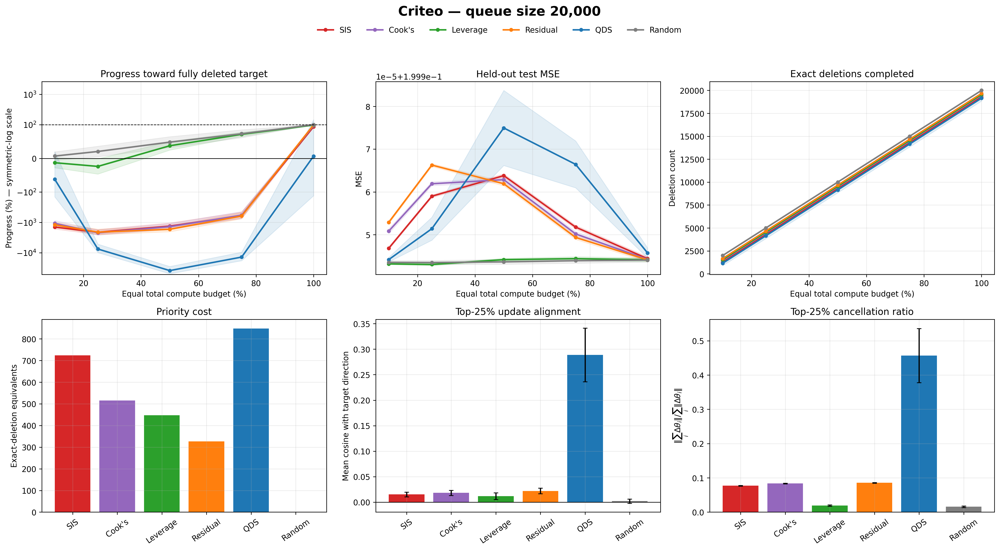
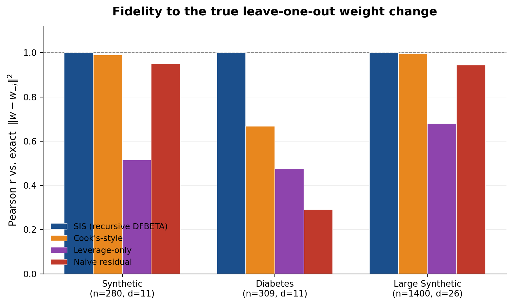
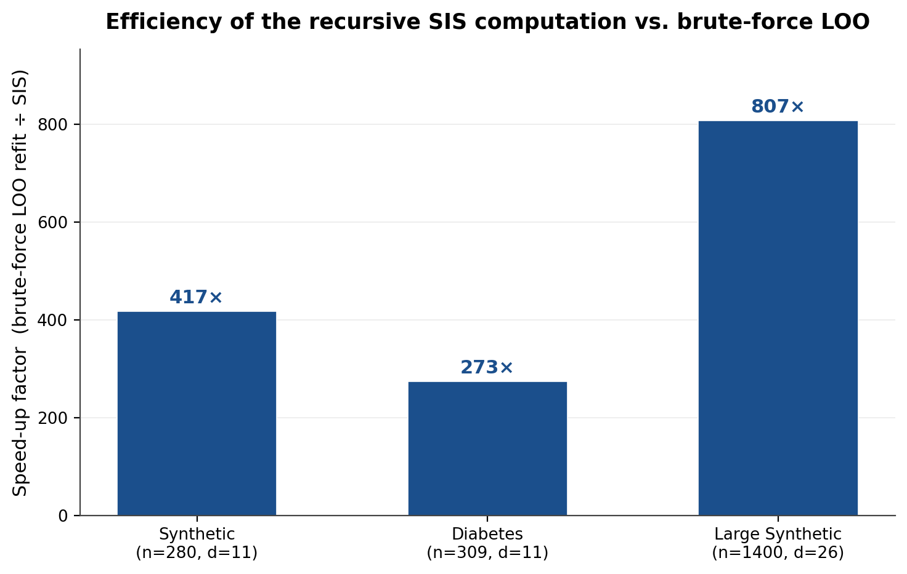
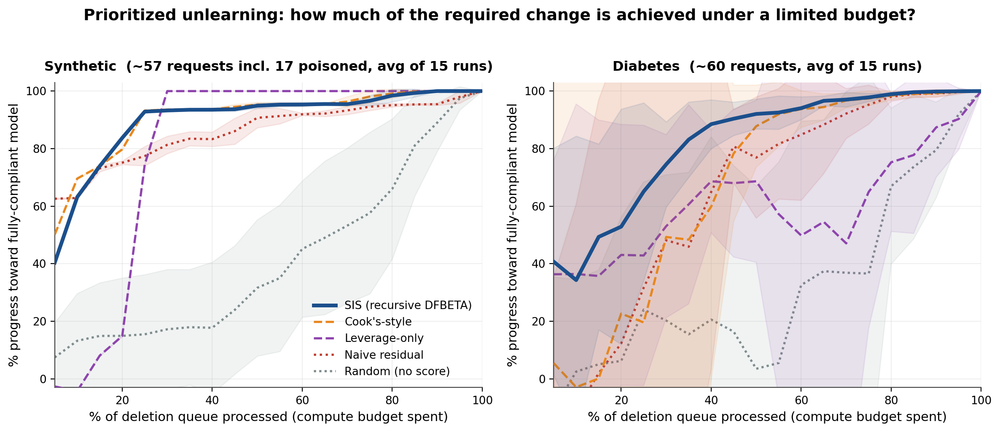
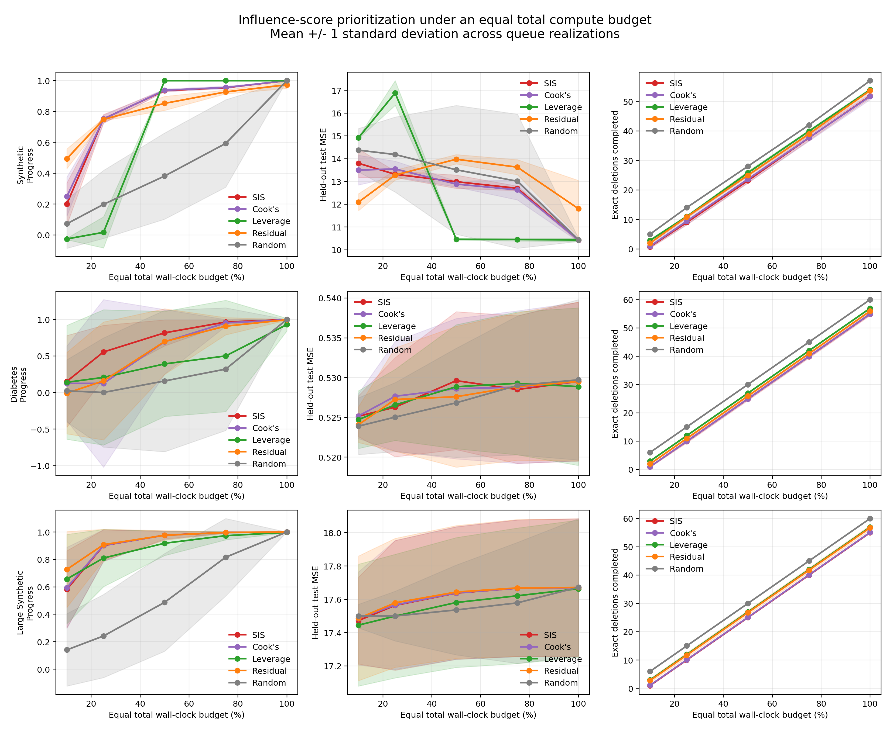
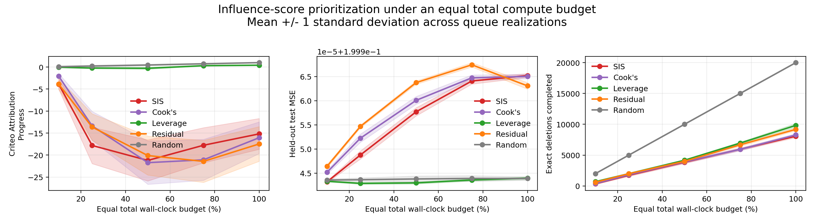
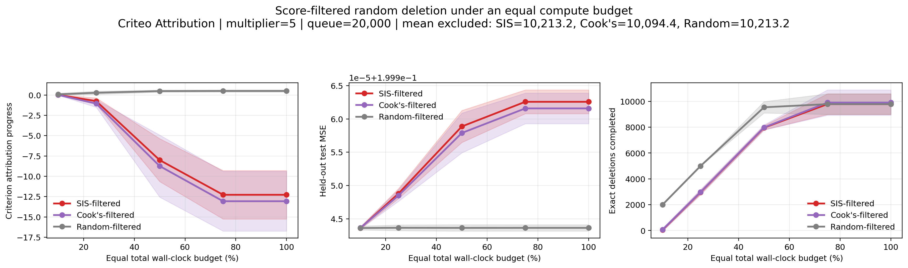

# Individual Influence Is Not Queue Influence

## Deletion-Queue Prioritization for Machine Unlearning Under Limited Compute Budgets

This repository studies a practical machine-unlearning scheduling problem: when a model receives more valid deletion requests than it can process immediately, which requests should be unlearned first?

A natural policy ranks requests by an individual influence score. This project tests whether that pointwise ranking remains useful when deletion is sequential, the queue is large, model state changes after every exact update, and scoring itself consumes part of the available wall-clock budget.

The main empirical result is a **score-to-schedule gap**:

> An influence score can be exact for one isolated deletion without being an effective priority rule for a large deletion queue.

In the largest Criteo experiment (1.8 million training impressions and a 20,000-request queue), static SIS, Cook's distance, and residual ranking moved sharply away from the fully deleted target at early and intermediate budgets. Leverage was the most stable scored baseline, while random scheduling was consistently strong because it paid no scoring cost and mixed deletion directions. These findings are specific to the tested linear/RLS setting and should not be interpreted as a universal ranking theorem.



---

## Authorship and use of AI coding tools

The research problem, study framing, experimental architecture, implementation design, evaluation protocol, ablation plan, analysis, interpretation, and conclusions were conceived and directed by **Swarup Jayaram Dhanavade**. The implementation code was generated with assistance from AI coding tools operating under the author's specifications and design. AI tools did not determine the research question, experimental choices, interpretation, or conclusions. The author reviewed, executed, debugged, and validated the experiments and takes responsibility for the methodology, reported results, and conclusions.

---

## Contents

- [Authorship and use of AI coding tools](#authorship-and-use-of-ai-coding-tools)
- [Research question](#research-question)
- [Why individual influence may fail at queue level](#why-individual-influence-may-fail-at-queue-level)
- [Model and exact deletion](#model-and-exact-deletion)
- [Scheduling policies](#scheduling-policies)
- [Equal-compute evaluation](#equal-compute-evaluation)
- [Datasets and scales](#datasets-and-scales)
- [Research workflow](#research-workflow)
- [Experiments](#experiments)
- [Main results](#main-results)
- [Mechanism analysis](#mechanism-analysis)
- [Interpretation and limitations](#interpretation-and-limitations)
- [Repository structure](#repository-structure)
- [Installation](#installation)
- [Reproducing the results](#reproducing-the-results)
- [Reproducibility notes](#reproducibility-notes)
- [Responsible claims](#responsible-claims)
- [License and data](#license-and-data)

---

## Research question

The project is organized around six questions.

1. **Pointwise exactness:** Does SIS/DFBETA recover the exact parameter change caused by deleting one observation?
2. **Score-to-schedule transfer:** Does a more accurate individual influence score produce better progress when many requests are selected from a queue?
3. **Compute-adjusted utility:** Does the benefit of scoring justify its cost when every policy receives the same total wall-clock budget?
4. **Queue-size scaling:** Does scheduling behavior change as the queue grows from tens to thousands of requests?
5. **Adaptivity:** Does periodic rescoring after small deletion batches repair a static ranking?
6. **Mechanism:** Can direction, cancellation, and ranking staleness explain the observed queue behavior?

This is an empirical study of **exact deletion scheduling**, not a proposal for approximate unlearning and not a claim that valid requests should be denied. A limited budget determines which pending requests are processed first; all requests remain valid.

---

## Why individual influence may fail at queue level

An individual influence score answers a local magnitude question:

> How much would the parameters change if this one observation were removed from the current model?

Queue scheduling asks a different question:

> Which sequence or subset of pending deletions brings the current model closest to the model obtained after deleting the entire queue, given a fixed compute budget?

The difference matters for three reasons.

### Direction

A large update is useful only if it points toward the fully deleted target. A high SIS value measures the squared magnitude of a one-point update; it does not guarantee alignment with the target queue update.

### Interaction and cancellation

Two individually large updates can oppose one another. If

```text
delta_i^T delta_j < 0,
```

their combined effect can be much smaller than their individual magnitudes suggest. A descending pointwise ranking does not model this set-level geometry.

### State dependence

After each exact deletion, the RLS inverse matrix, coefficients, residuals, leverage values, and influence scores can change. A policy computed at the initial state may therefore cease to represent the current model. The experiments measure this effect directly rather than assuming that staleness occurs.

---

## Model and exact deletion

The experiments use ridge-regularized recursive least squares (RLS). For a design matrix `X`, response `y`, and ridge parameter `lambda`, define

```text
P = (X^T X + lambda I)^(-1)
w = P X^T y
```

For observation `i`, let

```text
e_i = y_i - x_i^T w
h_i = x_i^T P x_i
```

The exact one-point deletion update is

```text
w_{-i} = w - (P x_i e_i) / (1 - h_i)
```

and the exact squared parameter displacement is

```text
SIS_i = ||w_{-i} - w||_2^2
      = e_i^2 ||P x_i||_2^2 / (1 - h_i)^2.
```

The implementation in [`Scripts/rls_influence.py`](Scripts/rls_influence.py) maintains the RLS state and applies exact recursive downdates through `unlearn()`.

The core identity tests compare SIS against both the analytic leave-one-out change and explicit refitting without the selected sample. The maximum relative error was approximately `2.46e-13` on the synthetic data and `6.63e-14` on Diabetes; Pearson correlation with brute-force refit was effectively `1.0`. This verifies that later queue failures are not explained by an inexact SIS formula.



---

## Scheduling policies

All scored policies sort in descending order unless an ablation explicitly says otherwise.

| Policy | Score | Meaning | Scoring cost charged? |
|---|---:|---|---:|
| SIS / DFBETA | `||delta_i||^2` | Exact isolated parameter-change magnitude | Yes |
| Cook's | `e_i^2 h_i / (1-h_i)^2` | Residual-and-leverage influence proxy | Yes |
| Leverage | `h_i` | Geometric extremeness in feature space | Yes |
| Residual | `e_i^2` | Prediction-error magnitude | Yes |
| Random | random permutation without replacement | Score-free control | No |
| FIFO | arrival order | Score-free operational baseline in the original queue experiment | No |
| QDS | alignment with the sum of queue deletion vectors, normalized by individual energy | Exploratory direction-aware policy | Yes |

Random sampling is without replacement, so a request can be deleted at most once in a realization.

QDS is an exploratory negative ablation. Its poor results mean the implemented normalization did not provide a robust queue policy; it should not be presented as a successful contribution.

---

## Equal-compute evaluation

The central experiment gives every policy the same measured total wall-clock budget.

For a queue of size `Q`, the code measures the median cost of one exact `unlearn()` operation, `t_delete`. A budget fraction `b` is then

```text
B(b) = b * Q * t_delete.
```

For a scored policy, score computation and sorting are timed and charged first:

```text
k_scored(b) = floor(max(0, B(b) - t_score - t_sort) / t_delete).
```

For random/FIFO, no influence-scoring cost is charged:

```text
k_random(b) = floor(B(b) / t_delete).
```

Counts are clipped to the queue size. Target-model construction and evaluation are excluded from the operational budget because they are required to evaluate every method, not to execute a policy in deployment.

### Progress metric

Let `w_0` be the original model, `w_Q` the model after exactly deleting the full queue, and `w_k` the model after the budget-limited prefix. Progress is

```text
progress(k) = 1 - ||w_k - w_Q||_2^2 / ||w_0 - w_Q||_2^2.
```

- `1` means the current model has reached the fully deleted target.
- `0` means it is no closer than the original model.
- A negative value means the processed prefix moved farther from the target than the original model was.

Negative progress is mathematically valid. It is not proof of an implementation error. Extremely negative percentages can occur when the denominator `||w_0-w_Q||^2` is small relative to an initially misaligned prefix update. Queue-research plots use a symmetric-logarithmic progress axis so large negative values remain visible without flattening the ordinary `0–100%` region.

### Secondary outcomes

The experiments also record:

- held-out test MSE;
- exact deletions completed;
- score and sort time;
- scoring cost expressed in deletion-equivalent operations;
- mean and standard deviation across matched queue realizations;
- paired tests against random in the research-extension runs.

Held-out MSE and target progress answer different questions. Similar MSE values do not imply that two intermediate models are equally close to the fully deleted target.

---

## Datasets and scales

| Dataset | Rows used | Training rows | Test rows | Dimension including bias | Typical queue sizes | Queue source |
|---|---:|---:|---:|---:|---:|---|
| Synthetic | 400 | 280 | 120 | 11 | 57–60 | Injected high-leverage/label-corrupted points plus sampled requests |
| Diabetes | 442 | 309 | 133 | 11 | 60 | Random unique training rows |
| Large synthetic | 2,000 | 1,400 | 600 | 26 | 60 | Random unique training rows |
| Criteo Attribution | 2,000,000 processed | 1,800,000 | 200,000 evaluated | 37 | 60, 2,000, 5,000, 20,000 | Simulated deletion requests sampled from real click-log impressions |

The Criteo features use a 32-dimensional hashing representation plus bias. The response is click/no-click and the reported MSE uses unclipped linear predictions (Brier-style squared error).

Important distinction: Criteo is a real production-scale click-log dataset, but the deletion-request queues are simulated by sampling unique training impressions. The repository does **not** claim to contain real user deletion-request logs.

---

## Research workflow

The project developed in the following sequence.

### 1. Establish exactness

The first experiments verified that the SIS formula equals the exact one-observation RLS parameter change and agrees with brute-force leave-one-out refitting.

### 2. Compare pointwise scores

SIS, Cook's distance, leverage, and residual magnitude were compared against exact parameter movement, held-out MSE change, and injected-outlier recovery.

### 3. Benchmark computational cost

Vectorized score computation was compared with brute-force leave-one-out refitting and with the cost of a queue of exact recursive deletions.

### 4. Introduce queue prioritization

Fixed queues were processed in descending score order, random order, and FIFO order. Progress toward the fully deleted target, test MSE, and poison clearance were measured across budgets.

### 5. Enforce an equal total budget

The protocol was changed so that score computation and sorting consume the same wall-clock budget later used for exact deletions. This isolates the operational value of prioritization from the cost of obtaining the priority order.

### 6. Add all five baselines

The equal-budget comparison was extended to SIS, Cook's, leverage, residual, and random policies.

### 7. Scale to a real click-log

The Criteo Attribution data loader streams up to two million rows, builds a 37-dimensional RLS model, retains a deletion pool, and tests queues ranging from 60 to 20,000 requests.

### 8. Test static versus adaptive rankings

Dynamic experiments recomputed scores after deleting batches equal to 10% or 5% of the original queue, charging every repeated score-and-sort pass to the budget.

### 9. Test filtering-plus-random ablations

The code computed a score, excluded low-score requests from the eligible set according to a cost multiplier, and randomly deleted without replacement from the retained set. Multipliers `5`, `10`, `20`, and `30` were tested. A three-way multiplier-5 comparison used SIS-based, Cook-based, and random filtering.

### 10. Add mechanism and statistical analysis

The research extension measured target-direction cosine, the fraction of negatively aligned individual updates, cancellation ratio, pairwise cosine, and rank correlation after partial deletion. It also added paired t-tests, Wilcoxon signed-rank tests, bootstrap 95% confidence intervals, Holm correction, Cohen's `d_z`, and a small target-aware greedy reference.

---

## Experiments

### Core pointwise validation

[`Scripts/run_experiments.py`](Scripts/run_experiments.py) evaluates:

- analytic SIS identity;
- brute-force leave-one-out agreement;
- Pearson correlation with exact parameter change;
- Spearman correlation with held-out MSE change;
- injected-outlier recovery;
- score-time versus refit-time scaling.

The measured SIS-versus-brute-force speedup grew from approximately `417x` on the 280-row synthetic training set to `807x` on the 1,400-row large-synthetic training set.



### Deletion-overhead benchmark

[`Scripts/run_deletion_benchmark.py`](Scripts/run_deletion_benchmark.py) measures deletion-only time, SIS scoring, Cook's scoring, and extrapolated brute-force scoring. For example, on Diabetes, SIS scoring added about `24.37%` of the time required for a 60-request exact-deletion queue, whereas brute-force scoring added over `5,300%`.

### Original queue experiment

[`Scripts/run_queue_experiment.py`](Scripts/run_queue_experiment.py) compares static score orders and random scheduling over a dense `5–100%` budget grid on synthetic and Diabetes queues.



### Equal-total-compute experiment

[`Scripts/run_equal_compute_budget_all_methods.py`](Scripts/run_equal_compute_budget_all_methods.py) compares the five main policies at `10%`, `25%`, `50%`, `75%`, and `100%` budgets over 30 queue realizations, reporting mean and standard deviation.



### Criteo scaling

[`Scripts/run_criteo_equal_compute_budget.py`](Scripts/run_criteo_equal_compute_budget.py) repeats the same equal-budget design on streamed Criteo data. Queue sizes `60`, `2,000`, `5,000`, and `20,000` test whether the score-to-schedule relationship changes with queue scale.

### Dynamic batch rescoring

[`Scripts/run_criteo_dynamic_rescoring_experiment.py`](Scripts/run_criteo_dynamic_rescoring_experiment.py) recomputes each score on the surviving queue after 5% or 10% batches. Every rescore and re-sort is charged.



### Filtering-plus-random ablations

[`Scripts/run_criteo_sis_filtered_random_experiment.py`](Scripts/run_criteo_sis_filtered_random_experiment.py) and [`Scripts/run_criteo_sis_cooks_random_filter_experiment.py`](Scripts/run_criteo_sis_cooks_random_filter_experiment.py) test whether preserving high-score requests while randomly deleting from the rest improves compute-constrained behavior.



### Queue-research extensions

[`Scripts/queue_research_extensions.py`](Scripts/queue_research_extensions.py) implements mechanism diagnostics, paired statistics, QDS, and the target-aware greedy reference. [`Scripts/run_queue_research_extensions.py`](Scripts/run_queue_research_extensions.py) is the working Diabetes/standard-NPZ runner, and [`Scripts/plot_queue_research_results.py`](Scripts/plot_queue_research_results.py) creates overview, staleness, statistics, and scale-comparison figures.

---

## Main results

### 1. Pointwise SIS is exact

| Dataset | SIS max relative error | SIS correlation with exact parameter change | SIS vs brute-force refit correlation |
|---|---:|---:|---:|
| Synthetic | `2.46e-13` | `1.000` | `1.000` |
| Diabetes | `6.63e-14` | `1.000` | `1.000` |
| Large synthetic | `8.48e-13` | `1.000` | `1.000` |

Therefore, poor queue behavior cannot be dismissed as a failure to calculate isolated deletion influence correctly.

### 2. Small-queue results can favor influence ranking

On Diabetes with queue size 60 and 30 repetitions, mean progress at budgets `[10, 25, 50, 75, 100]%` was:

| Policy | 10% | 25% | 50% | 75% | 100% |
|---|---:|---:|---:|---:|---:|
| SIS | 0.00% | 40.89% | 82.33% | 94.90% | 99.49% |
| Cook's | 0.00% | 30.63% | 78.06% | 92.12% | 99.14% |
| Leverage | 0.00% | 22.44% | 49.34% | 74.55% | 90.89% |
| Residual | 0.00% | 16.81% | 74.05% | 89.30% | 99.09% |
| Random | 12.17% | 18.05% | 29.37% | 61.39% | 100.00% |

The zero values at the smallest budget occur when scoring consumes the available budget before an exact deletion can be completed.

### 3. The ordering changes at larger Criteo queues

Mean target progress from the mechanism/statistics runs is shown below.

#### Criteo queue size 2,000, 5 repeats

| Policy | 10% | 25% | 50% | 75% | 100% |
|---|---:|---:|---:|---:|---:|
| SIS | -97.56% | -169.09% | -44.37% | 28.98% | 99.19% |
| Cook's | -70.36% | -169.69% | -60.72% | 29.56% | 99.62% |
| Leverage | 22.78% | 36.65% | 62.90% | 82.88% | 98.74% |
| Residual | -95.92% | -156.78% | -96.58% | 27.36% | 99.96% |
| Random | 4.79% | 14.20% | 50.13% | 72.83% | 100.00% |

This is a validation run; five repetitions are not sufficient for strong statistical claims.

#### Criteo queue size 20,000, 30 repeats

| Policy | 10% | 25% | 50% | 75% | 100% |
|---|---:|---:|---:|---:|---:|
| SIS | -1,428.86% | -2,119.06% | -1,329.24% | -599.47% | 93.85% |
| Cook's | -1,075.77% | -2,207.90% | -1,389.68% | -578.84% | 97.26% |
| Leverage | -12.99% | -23.91% | 37.32% | 71.27% | 98.78% |
| Residual | -1,200.45% | -2,103.34% | -1,689.36% | -615.79% | 99.29% |
| Random | 6.78% | 20.37% | 48.14% | 72.96% | 100.00% |

At this scale, SIS, Cook's, and residual are substantially worse than random through the intermediate budgets. Leverage is much more stable than the other scored policies, but random is still better at 10%, 25%, and 50%, and statistically indistinguishable from leverage at 75% in the paired progress comparison (`Holm-adjusted paired t p = 0.469`).

For SIS versus random at queue size 20,000, the paired mean progress differences at `[10, 25, 50, 75, 100]%` were approximately `[-14.36, -21.39, -13.77, -6.72, -0.061]` in progress units; every bootstrap interval excluded zero. This is strong evidence for the observed gap within this experiment.

### 4. Test MSE changes are numerically small

On Criteo, test MSE remains close to `0.19994` across methods and budgets even when parameter-space progress differs sharply. The scheduling result is therefore principally about reaching the exact fully deleted parameter target under limited compute, not about producing a large immediate improvement in predictive MSE.

### 5. Dynamic rescoring did not repair the large-queue result

At queue size 20,000, 5% and 10% batch rescoring remained poor for SIS, Cook's, and residual, while repeated scoring consumed additional deletion capacity. At the 100% nominal budget, mean progress for 5% batch rescoring was approximately `-1518%` for SIS and `41.8%` for leverage; for 10% batches it was approximately `-942%` for SIS and `66.6%` for leverage. Random reached the target because it spent the full budget on deletion.

This does not prove that adaptivity is useless. It shows that this particular rescore-after-fixed-batch design did not justify its measured cost.

### 6. Filtering-plus-random did not produce the expected improvement

The low-score exclusion experiments did not outperform the score-free random baseline. Larger exclusion multipliers quickly left too few eligible requests, causing progress to plateau. The multiplier-5 three-way experiment also showed that SIS- and Cook-filtered retained sets were worse than a count-matched random filter in this setting.

---

## Mechanism analysis

The queue-size-20,000 research extension provides a useful separation between hypotheses.

### Direction and cancellation are present

For the top 25% selected by SIS:

- mean cosine with the full-queue target direction was only `0.015`;
- approximately `46.6%` of isolated deletion vectors had negative target cosine;
- the cancellation ratio was `0.077`, where `1` indicates perfect reinforcement and values near `0` indicate strong cancellation.

Cook's and residual showed similarly weak alignment and strong cancellation. These measurements support the argument that large isolated magnitude is not the same as useful queue-level direction.

### Ranking staleness was not the dominant Criteo mechanism

Contrary to the initial hypothesis, SIS, Cook's, leverage, and residual rank correlations remained above `0.99998` after deleting 50% of the queue in the 20,000-request run. In this setting, the poor static schedules cannot be attributed mainly to rapid score-rank drift.

This negative mechanism result is important: periodic rescoring added cost without materially repairing a ranking that was already stable but misaligned with the target objective.

### QDS exposed a normalization failure

QDS produced more positive target alignment but extremely poor queue progress. This indicates that rewarding direction alone, especially after normalizing by individual update energy, can create overshoot, scale, or composition problems. QDS is retained as an exploratory failure case and a motivation for better constrained marginal-gain objectives.

### Greedy target-aware reference

For a small 30-request subset, a target-aware one-step look-ahead policy achieved mean progress `0.890` after 15 deletions. It is a diagnostic reference rather than a deployable baseline because it uses the fully deleted target and evaluates every remaining candidate.

---

## Interpretation and limitations

### What the study supports

- SIS is exact for an isolated deletion in this RLS implementation.
- Exact pointwise influence does not guarantee effective queue-level ordering.
- Scoring and sorting cost can materially reduce the number of requests processed under a fixed wall-clock budget.
- Queue size changes the empirical ordering of policies.
- Leverage was the most robust scored policy on the tested large Criteo queues.
- Random scheduling is a serious operational baseline, not a placeholder.
- Direction and cancellation help explain why magnitude-based ordering can fail.

### What the study does not establish

- It does not prove that leverage is universally optimal.
- It does not show that SIS is incorrect; SIS passed the exactness checks.
- It does not establish a new theorem about group influence or non-additivity.
- It does not use real deletion-request logs.
- It does not evaluate nonlinear models, classification-specific unlearning algorithms, distributed systems, privacy guarantees, or adversarial request arrival.
- It does not yet include independent hardware replication or multiple large real datasets.

### Threats to validity

- Wall-clock measurements depend on hardware, BLAS implementation, operating system, background load, and Python version.
- The Criteo model is a linear regression treatment of a binary target; test MSE is informative but not a complete click-model evaluation.
- Feature hashing can create collisions.
- Requests are sampled from a stored training pool rather than observed from a production deletion log.
- Extreme normalized progress is sensitive to a small initial-to-target distance.
- Some archived Criteo result folders were produced during iterative development and use inconsistent filenames; see the reproducibility notes below

---

## Repository structure

The current GitHub repository was audited on 2026-08-21. Images are stored beside their corresponding JSON/CSV outputs under `Results/`.

```text
.
├── LICENSE
├── README.md
├── requirements.txt
├── Scripts/
│   ├── rls_influence.py
│   ├── run_experiments.py
│   ├── run_deletion_benchmark.py
│   ├── run_queue_experiment.py
│   ├── run_equal_compute_budget_experiment.py
│   ├── run_equal_compute_budget_all_methods.py
│   ├── run_criteo_equal_compute_budget.py
│   ├── run_criteo_dynamic_rescoring_experiment.py
│   ├── run_criteo_sis_filtered_random_experiment.py
│   ├── run_criteo_sis_cooks_random_filter_experiment.py
│   ├── queue_research_extensions.py
│   ├── run_queue_research_extensions.py
│   ├── run_criteo_queue_research_extensions.py
│   ├── plot_queue_research_results.py
│   └── make_*.py
└── Results/
    ├── Core/
    │   ├── results.json
    │   ├── deletion_benchmark.json
    │   ├── queue_results.json
    │   └── fig1_*.png ... fig8_*.png
    ├── equal_budget/
    │   ├── base/
    │   └── all_methods/
    ├── diabetes/
    ├── criteo/
    │   ├── static/
    │   │   ├── default/
    │   │   ├── queue60/
    │   │   ├── queue2000/
    │   │   ├── queue5000/
    │   │   ├── queue20000/
    │   │   └── ulta_queue20000/
    │   ├── dynamic/
    │   │   ├── batch5pct/
    │   │   └── batch10pct/
    │   └── queue_research/
    │       ├── diabetes/
    │       ├── queue60/
    │       ├── queue2000/
    │       └── queue20000/
    └── ablations/
        ├── filter_m5/
        ├── filter_m10/
        ├── filter_m20/
        └── filter_m30/
```

JSON files contain raw summaries and, for research-extension runs, repetition-level records. CSV files contain plot tables or paired statistical tests. PNG files are the GitHub-preview figures. PDF output is supported by several plotting scripts but is not consistently committed.

---

## Installation

Python 3.12 was used in the recorded Windows runs.

### Windows PowerShell

```powershell
git clone https://github.com/swarupd07/Deletion-Queue-Prioritization-for-Machine-Unlearning-Under-Limited-Compute-Budgets.git
Set-Location Deletion-Queue-Prioritization-for-Machine-Unlearning-Under-Limited-Compute-Budgets

py -3.12 -m venv .venv
Set-ExecutionPolicy -Scope Process -ExecutionPolicy RemoteSigned
& .\.venv\Scripts\Activate.ps1

python -m pip install --upgrade pip
python -m pip install -r requirements.txt
```

Always use `python -m pip` from the activated environment. This prevents the common situation in which `pip` installs packages into a different Python interpreter and the experiment later raises `ModuleNotFoundError`.

PowerShell uses the backtick `` ` `` for line continuation. A Unix backslash `\` is not valid PowerShell continuation syntax.

### Linux/macOS

```bash
git clone https://github.com/swarupd07/Deletion-Queue-Prioritization-for-Machine-Unlearning-Under-Limited-Compute-Budgets.git
cd Deletion-Queue-Prioritization-for-Machine-Unlearning-Under-Limited-Compute-Budgets

python3 -m venv .venv
source .venv/bin/activate
python -m pip install --upgrade pip
python -m pip install -r requirements.txt
```

---

## Reproducing the results

The following commands are written for PowerShell and assume the repository root is the current directory.

### 1. Core exactness, scaling, queue, and overhead results

The original core scripts use fixed filenames in the current working directory. Run them from `Results/Core` so outputs land in the committed location.

```powershell
Push-Location Results\Core

python ..\..\Scripts\run_experiments.py
python ..\..\Scripts\make_figures.py

python ..\..\Scripts\run_queue_experiment.py
python ..\..\Scripts\make_queue_figures.py

python ..\..\Scripts\run_deletion_benchmark.py
python ..\..\Scripts\make_deletion_benchmark_figure.py

Pop-Location
```

Generated files: `results.json`, `queue_results.json`, `deletion_benchmark.json`, and `fig1` through `fig8` PNGs.

### 2. Equal-budget SIS/FIFO/random experiment

```powershell
python Scripts\run_equal_compute_budget_experiment.py `
  --repeats 30 `
  --timing-reps 11 `
  --output Results\equal_budget\base\equal_compute_budget_results.json

python Scripts\make_equal_compute_budget_figures.py `
  --input Results\equal_budget\base\equal_compute_budget_results.json `
  --output-dir Results\equal_budget\base
```

### 3. Equal-budget five-policy experiment

```powershell
python Scripts\run_equal_compute_budget_all_methods.py `
  --repeats 30 `
  --timing-reps 11 `
  --output Results\equal_budget\all_methods\equal_compute_budget_all_methods_results.json

python Scripts\make_equal_compute_budget_all_methods_figures.py `
  --input Results\equal_budget\all_methods\equal_compute_budget_all_methods_results.json `
  --output-dir Results\equal_budget\all_methods
```

### 4. Criteo static equal-budget scaling

The first run downloads the Criteo Attribution dataset only after `--accept-license` is supplied. Review the upstream terms before running. The data is stored under `data/criteo/` and should not be committed.

Quick validation:

```powershell
python Scripts\run_criteo_equal_compute_budget.py `
  --accept-license `
  --max-rows 2000000 `
  --queue-size 60 `
  --queue-pool-size 25000 `
  --repeats 2 `
  --timing-reps 3 `
  --output Results\criteo\static\queue60\criteo_equal_budget_queue60_test.json
```

Full queue-size runs:

```powershell
python Scripts\run_criteo_equal_compute_budget.py `
  --accept-license `
  --max-rows 2000000 `
  --queue-size 60 `
  --queue-pool-size 25000 `
  --repeats 30 `
  --timing-reps 11 `
  --output Results\criteo\static\queue60\criteo_equal_budget_queue60.json

python Scripts\run_criteo_equal_compute_budget.py `
  --accept-license `
  --max-rows 2000000 `
  --queue-size 2000 `
  --queue-pool-size 25000 `
  --repeats 30 `
  --timing-reps 11 `
  --output Results\criteo\static\queue2000\criteo_equal_budget_queue2000.json

python Scripts\run_criteo_equal_compute_budget.py `
  --accept-license `
  --max-rows 2000000 `
  --queue-size 5000 `
  --queue-pool-size 25000 `
  --repeats 30 `
  --timing-reps 11 `
  --output Results\criteo\static\queue5000\criteo_equal_budget_queue5000.json

python Scripts\run_criteo_equal_compute_budget.py `
  --accept-license `
  --max-rows 2000000 `
  --queue-size 20000 `
  --queue-pool-size 25000 `
  --repeats 30 `
  --timing-reps 11 `
  --output Results\criteo\static\queue20000\criteo_equal_budget_queue20000.json
```

Plot any static run with:

```powershell
python Scripts\make_equal_compute_budget_all_methods_figures.py `
  --input Results\criteo\static\queue20000\criteo_equal_budget_queue20000.json `
  --output-dir Results\criteo\static\queue20000
```

### 5. Dynamic 5% and 10% rescoring

The dynamic runner now proceeds directly to the experiment loop; repeated scoring and sorting are charged to each scored policy. Run:

```powershell
python Scripts\run_criteo_dynamic_rescoring_experiment.py `
  --accept-license `
  --max-rows 2000000 `
  --queue-size 20000 `
  --queue-pool-size 25000 `
  --batch-fraction 0.05 `
  --repeats 30 `
  --timing-reps 11 `
  --output Results\criteo\dynamic\batch5pct\criteo_dynamic_rescoring_5pct.json

python Scripts\run_criteo_dynamic_rescoring_experiment.py `
  --accept-license `
  --max-rows 2000000 `
  --queue-size 20000 `
  --queue-pool-size 25000 `
  --batch-fraction 0.10 `
  --repeats 30 `
  --timing-reps 11 `
  --output Results\criteo\dynamic\batch10pct\criteo_dynamic_rescoring_results.json
```

Plot each output with `make_equal_compute_budget_all_methods_figures.py` using its matching folder as `--output-dir`.

### 6. SIS-filtered random ablations

Example for multiplier 20:

```powershell
python Scripts\run_criteo_sis_filtered_random_experiment.py `
  --accept-license `
  --max-rows 2000000 `
  --queue-size 20000 `
  --queue-pool-size 25000 `
  --score-cost-multiplier 20 `
  --repeats 30 `
  --timing-reps 11 `
  --output Results\ablations\filter_m20\sis_filtered_random_m20.json

python Scripts\make_sis_filtered_random_figure.py `
  --input Results\ablations\filter_m20\sis_filtered_random_m20.json `
  --output-dir Results\ablations\filter_m20 `
  --prefix sis_filtered_random_m20
```

Replace `20` with `10` or `30` and use the corresponding result folder. For multiplier 5, the three-filter comparison is:

```powershell
python Scripts\run_criteo_sis_cooks_random_filter_experiment.py `
  --accept-license `
  --max-rows 2000000 `
  --queue-size 20000 `
  --queue-pool-size 25000 `
  --score-cost-multiplier 5 `
  --repeats 30 `
  --timing-reps 11 `
  --output Results\ablations\filter_m5\sis_cooks_random_filter_m5.json

python Scripts\make_sis_cooks_random_filter_figure.py `
  --input Results\ablations\filter_m5\sis_cooks_random_filter_m5.json `
  --output-dir Results\ablations\filter_m5 `
  --prefix sis_cooks_random_filter_m5
```

### 7. Diabetes mechanism/statistics extension

```powershell
python Scripts\run_queue_research_extensions.py `
  --dataset diabetes `
  --queue-size 60 `
  --repeats 30 `
  --timing-reps 11 `
  --oracle-queue-size 30 `
  --output Results\diabetes\diabetes_queue_extensions.json

python Scripts\plot_queue_research_results.py `
  Results\diabetes\diabetes_queue_extensions.json `
  --output-dir Results\criteo\queue_research\diabetes
```

### 8. Criteo mechanism/statistics extension

This runner requires a locally generated `criteo_rls_state.npz` containing `P`, `w`, `X_history`, `y_history`, `X_test`, `y_test`, `lam`, and `n_seen`. The state file is intentionally not committed because it is generated, large, and derived from third-party data.

Example validation run:

```powershell
python Scripts\run_criteo_queue_research_extensions.py `
  --dataset rls-state `
  --npz-file criteo_rls_state.npz `
  --queue-size 60 `
  --repeats 2 `
  --timing-reps 3 `
  --oracle-queue-size 10 `
  --output Results\criteo\queue_research\queue60\criteo_queue_test.json
```

Full queue-size-20,000 run:

```powershell
python Scripts\run_criteo_queue_research_extensions.py `
  --dataset rls-state `
  --npz-file criteo_rls_state.npz `
  --queue-size 20000 `
  --repeats 30 `
  --timing-reps 11 `
  --oracle-queue-size 30 `
  --output Results\criteo\queue_research\queue20000\criteo_queue_20000_final.json
```

The archived results are:

- `Results/criteo/queue_research/queue60/criteo_queue_test.json`
- `Results/criteo/queue_research/queue2000/criteo_queue_2000_validation.json`
- `Results/criteo/queue_research/queue20000/criteo_queue_20000_final.json`

They can be re-plotted immediately:

```powershell
python Scripts\plot_queue_research_results.py `
  Results\criteo\queue_research\queue60\criteo_queue_test.json `
  Results\criteo\queue_research\queue2000\criteo_queue_2000_validation.json `
  Results\criteo\queue_research\queue20000\criteo_queue_20000_final.json `
  --output-dir Results\criteo\queue_research
```

---

## Reproducibility notes

The executable runners and analysis engine must remain separate:

1. `Scripts/queue_research_extensions.py` must contain one clean copy of the analysis engine that defines `run_repeated_study()`.
2. `Scripts/run_criteo_queue_research_extensions.py` must contain the shorter CLI runner that loads `criteo_rls_state.npz` and calls `run_repeated_study()`.
3. **RLS-state prerequisite.** The Criteo mechanism/statistics experiment cannot be regenerated from a clean clone until the local RLS-state NPZ has been constructed from the Criteo data.
4. **Static queue-20,000 filename.** Verify that files stored under `Results/criteo/static/queue20000/` contain internal metadata for a 20,000-request queue; do not infer queue size from the folder name alone.
5. **Large/generated data.** `criteo_rls_state.npz`, downloaded Criteo files, virtual environments, and cache directories should remain excluded from Git.
6. **Timing replication.** Wall-clock measurements depend on the processor, BLAS implementation, Python environment, operating system, and background load. Exact timings are not expected to match across machines.

The committed JSON, CSV, and PNG files preserve the recorded outputs. Regenerated wall-clock results should be treated as a hardware-specific replication rather than expected byte-for-byte reproduction.

---

## Responsible claims

A defensible summary of the contribution is:

1. The project formulates deletion-request prioritization as a compute-constrained scheduling problem targeting the fully deleted model.
2. It separates pointwise influence accuracy from queue-level scheduling effectiveness in an RLS setting where exact deletion effects are available.
3. It introduces an evaluation protocol that charges scoring, sorting, and exact unlearning to one measured wall-clock budget.
4. It studies queue-size scaling, periodic rescoring, direction, cancellation, staleness, statistical significance, and filtering ablations.
5. It provides evidence that magnitude-based influence rankings can fail badly for large queues even when their one-point influence values are exact.

The safest headline conclusion is:

> In these experiments, exact individual influence did not reliably transfer to compute-effective queue prioritization. Large-queue performance depended on update direction, cancellation, selection composition, and scoring overhead. Leverage was the strongest scored baseline at large Criteo queue sizes, but random scheduling remained highly competitive and often superior.

---

## License and data

The source code is released under the [MIT License](LICENSE).

The MIT license applies to this repository's code, not to third-party datasets. The Criteo Attribution data is not redistributed here. Users must review and accept the original dataset terms before downloading or running the Criteo experiments.

---

## Citation

If this repository supports a paper, thesis, or report, add the final BibTeX entry here after the work receives a stable title, author list, year, and archival URL.

```bibtex
@misc{individual_influence_not_queue_influence,
  title  = {Individual Influence Is Not Queue Influence: Deletion-Queue Prioritization for Machine Unlearning Under Limited Compute Budgets},
  author = {Swarup Jayaram Dhanavade},
  year   = {2026},
  note   = {Research code and empirical results}
}
```
